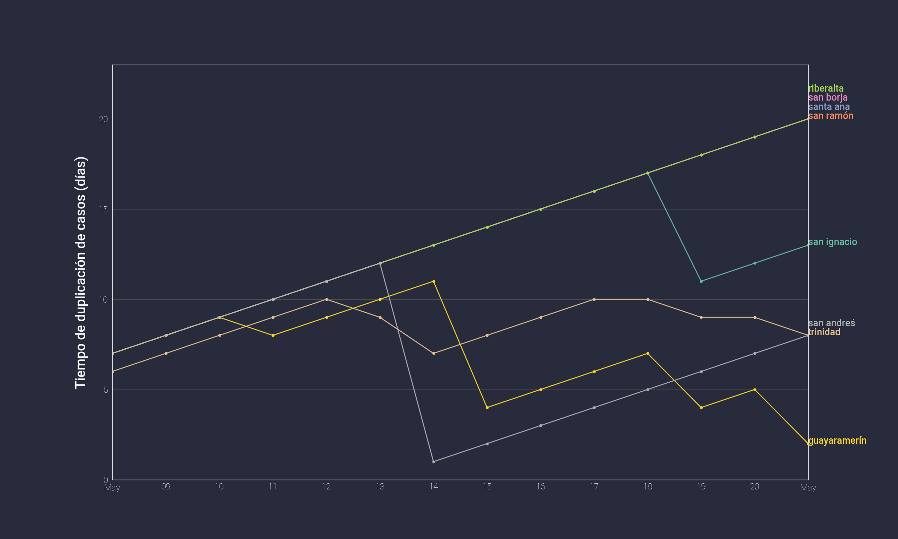

## Casos de Covid-19 en Beni

> De acuerdo a reportes de SEDES Beni ( [facebook](https://www.facebook.com/SEDES-BENI-2020-517750071766113/) ) y TaxiNoticias ([facebook](https://www.facebook.com/TaxiNoticiasBolivia/))

### Datos

Desde el 1 de mayo:

- [Total](https://github.com/mauforonda/covid19-beni/blob/master/total.csv): incluye casos confirmados, pendientes, recuperados y fallecidos
- [Casos confirmados por municipio](https://github.com/mauforonda/covid19-beni/blob/master/municipios.csv)

### Casos desde el 1 de mayo en una escala logarítmica

### Tiempo que toma un municipio en duplicar el número de casos en los últimos 14 días

---

Pienso actualizar los datos diariamente. 
